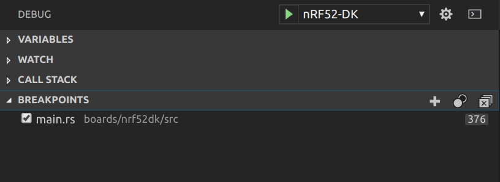
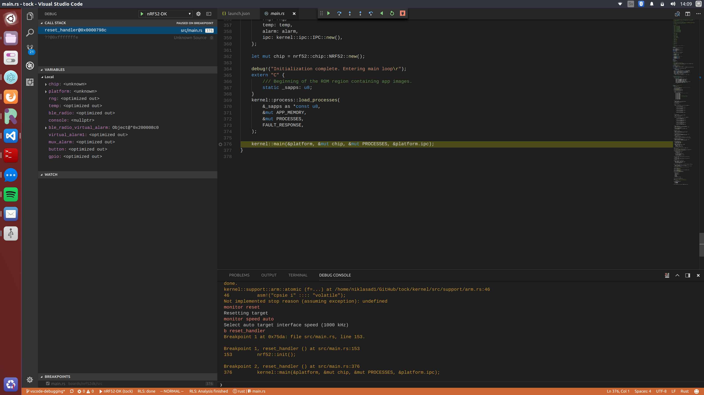

VSCode Debugging
========

This is a guide on how to perform remote debugging via JTAG in Tock using VSCode
(at the moment (Feb 2018) nRF51-DK and nRF52-DK are supported).

## Requirements
1. [VSCode](https://code.visualstudio.com)
2. [VSCode Native Debug Extension](https://github.com/WebFreak001/code-debug)
3. [VSCode Rust Extension](https://github.com/editor-rs/vscode-rust)

## Installation
1. Install VSCode for your platform
2. Open VSCode
3. Enter the extensions menu by pressing `View/Extensions`
4. Install `Native Debug` and `Rust` in that view by searching for them

You are now good to run the debugger and the debugging configurations are
already set for you. But, if you want change the configuration, for example to
run some special GDB commands before starting, you can do that
[here](../../.vscode/launch.json).

## Enabling breakpoints
Let's now test if this works by configuring some breakpoints:

1. Enter `Explorer mode` by pressing `View/Explorer`
2. Browse and open a file where you want to enable a breakpoint
3. In my case I want to have a breakpoint in the `main` in main.rs
4. Click to the left of the line number to enable a breakpoint. You should see a
   red dot now as the figure below:

    

## Running the debugger
1. You need to start the `GDB Server` before launching a debugging session in
   VSCode (check out the instructions for how to do that for your board).
2. Enter `Debug mode` in VSCode by pressing `View/Debug`. You should now see a
   debug view somewhere on your screen as in the figure below:

    

3. Choose your board in the scroll bar and then click on the green arrow or
   `Debug/Start Debugging`.
4. You should now see that program stopped at the breakpoint as the figure below:

    

5. Finally, if want to use specific GDB commands you can use the debug console
   in VSCode which is very useful.


## Issues
1. Sometimes GDB behaves unpredictably and stops at the wrong source line. For
   example, sometimes we have noticed that debugger stops at
   `/kernel/src/support/arm.rs` instead of the `main`. If that occurs
   just press `step over` and it should hopefully jump to correct location.
2. Rust in `release mode` is optimizing using things such as inlining and
   mangling which makes debugging harder and values may not be visible. To
   perform more reliable debugging mark the important functions with:

    ```
    #[no_mangle]
    #[inline(never)]
    ```
3. Enable `rust-pretty printer` or something similar because viewing variables
   is very limited in VSCode.
